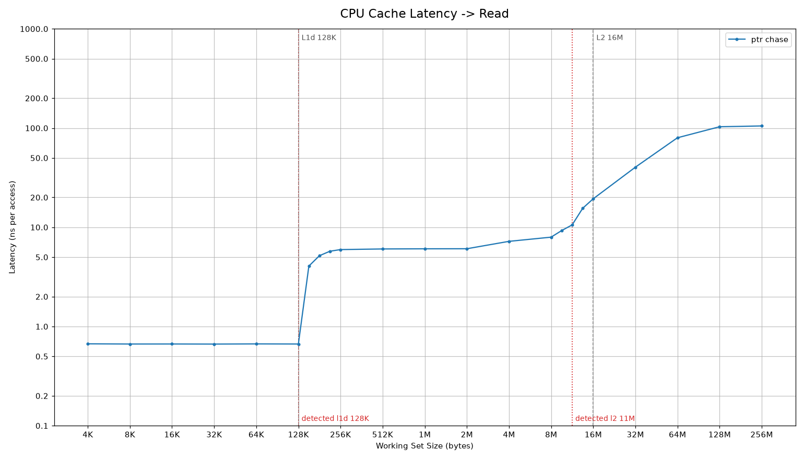
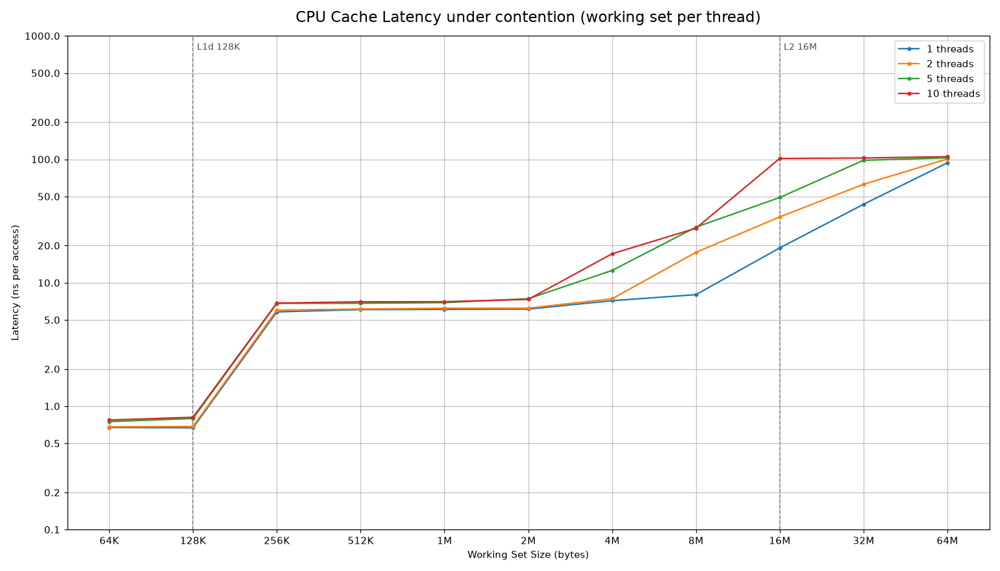
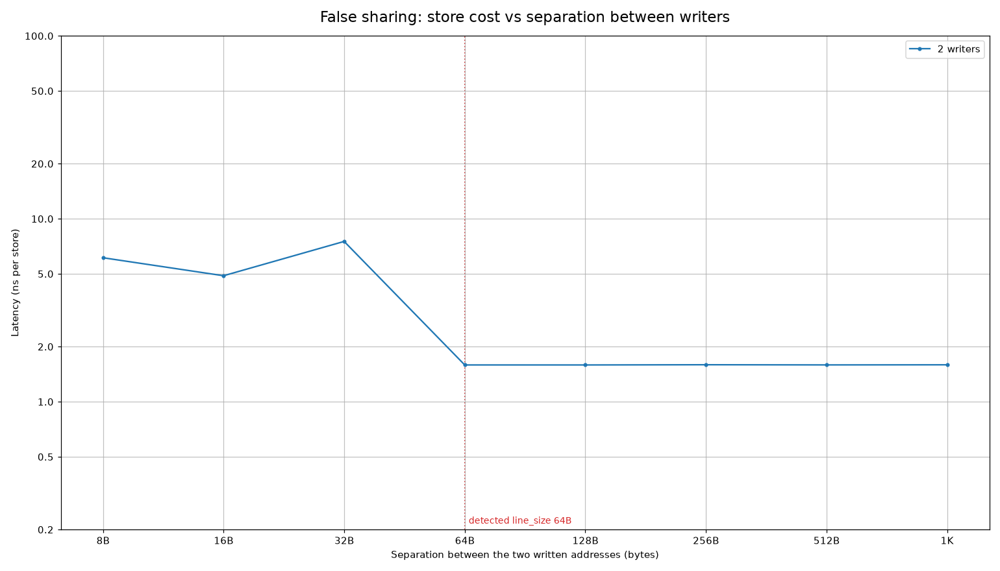
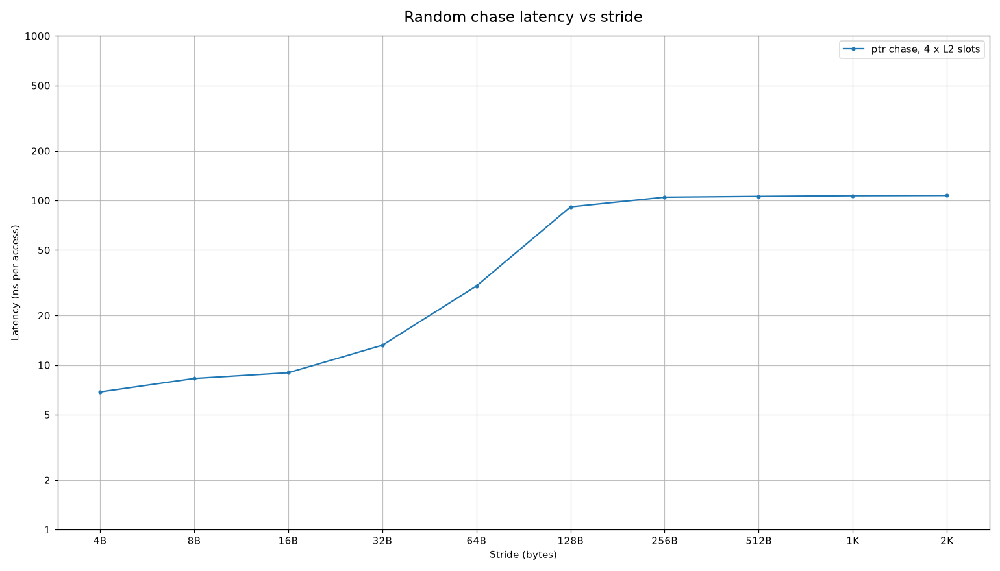
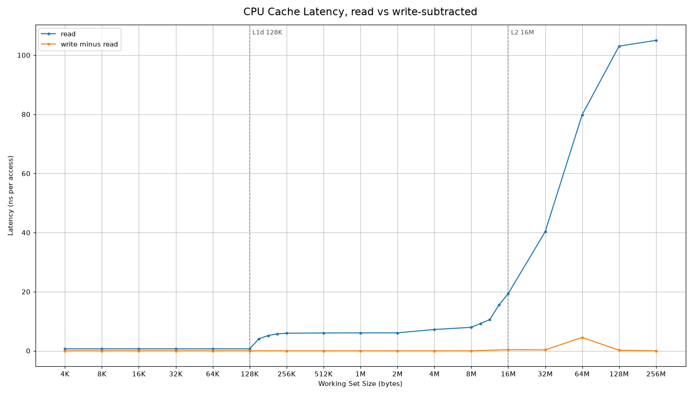

# Cache Performance

An empirical latency profile of the memory hierarchy on Apple Silicon.
It measures what a hot path pays for each dependent load
at every cache level, as the number of busy cores grows, and when two cores
write to the same line. It then recovers the cache geometry from those curves
and checks it against what `sysctl` reports.

The core instrument is a pointer chase over a Sattolo shuffle. Each load's
address is the result of the previous load, so there is no memory level
parallelism, no prefetching and no out of order overlap to hide the cost.

## How this applies to Trading Systems

Latencies are measured in nanoseconds. Cycle counts assume the nominal P core
clock of ~4.4 GHz.

- Per core hot state has a hard budget of 128 KB. Inside it, a dependent load
  takes 0.67 ns, ~3 cycles. At 152 KB it's already 4.1 ns, a 6x step, and from
  256 KB it settles at 6 ns, ~27 cycles and 9x. Size order books, symbol tables
  and per instrument state against that measured edge, not the spec sheet.
- L2 is budgeted per cluster, not per core. Five busy cores share one 16 MB
  L2. At 4 MB per thread, 5 threads pay 1.8x and 10 threads 2.4x what a single
  thread pays; at 8 MB per thread even 2 threads pay 2.2x. Under random access
  the usable capacity is 8 -> 11 MB, not 16, and a thread per core design has
  to divide that number.
- State owned by different writers needs to sit at least 64 B apart on this
  chip. Two cores updating counters 8 -> 32 B apart pay 3 -> 5x per update; at
  64 B or more they don't interact. Padding to 128 B also clears the L2 line.
- A DRAM miss costs 105 ns, ~460 cycles, which is more than a hundred L1 hits.
  Data that falls out of L2 first lands on the system level cache shelf at
  16 MB -> 64 MB (19 -> 80 ns).

## Results on an Apple M4 Max

The chip has 10 P cores in two clusters of 5, with each cluster sharing a 16 MB
L2, 128 KB of L1d per core, and 16 KB pages. The numbers below come from one
run of `./build/cache_bench`, taking the minimum over trials, with threads
steered onto P cores through a QoS class.

| quantity | detected | next point measured | `sysctl` | note |
|---|---|---|---|---|
| L1d capacity | 128 KB | 152 KB | 128 KB | exact |
| L2 capacity | 11 MB | 13 MB | 16 MB | 8 -> 11 MB across runs, see "Why L2 reads low" |
| coherence granularity | 64 B | | 128 B (`hw.cachelinesize`) | see "64 or 128" |

| level | latency per dependent load (ns) |
|---|---|
| L1d hit (4 KB -> 128 KB) | 0.67 |
| L2 hit (256 KB -> 8 MB) | 6.0 -> 8.0 |
| system level cache (16 MB -> 64 MB) | 19 -> 80 |
| DRAM (128 MB and up) | 103 -> 105 |

### Working set vs latency



Latency is flat at 0.67 ns through 128 KB, jumps 6x at 152 KB, and stays flat
again to 8 MB. From there it climbs through 11 MB (10.6 ns), 13 MB (15.5 ns)
and 16 MB (19.4 ns) up to DRAM latency. The red dotted lines mark what the
detector picked and the grey dashed lines mark `sysctl`.

### Shared L2 contention



Each thread chases its own private chain. While every thread's working set
fits in L1, all thread counts overlap, because L1 is private. Per thread
latency degrades once N times the working set exceeds the cluster's L2. At
4 MB per thread, a single thread is still in cache at 7.2 ns, while 5 threads
see 12.6 ns and 10 threads see 17.2 ns. At 8 MB per thread even 2 threads have
left L2 (17.6 ns against 8.0). By 64 MB per thread everyone is in DRAM and the
curves converge.

### False sharing and coherence granularity



Two threads each `fetch_add` their own counter, placed `sep` bytes apart. At 8,
16 and 32 B the counters share a coherence unit, so every increment waits for
ownership and costs 4.9 -> 7.5 ns. From 64 B on they stop interfering and sit
at 1.59 ns, flat out to 1 KB. The drop happens at 64 B, not at the 128 B that
`hw.cachelinesize` reports.

### Stride sweep (footprint, not line size)



This is a random chase over a fixed number of slots spaced `stride` bytes
apart. It's the textbook line size experiment, but with random ordering it
can't see the line size. The footprint grows with the stride, so the curve
really shows L2, then the system cache, then DRAM being exceeded in turn. It
stays in as a footprint sweep, and the line size comes from the false sharing
test instead.

### Store cost on the load path (negative result)



This is the same chase, except each visited node is also written to, and the
read only latency is subtracted out. The result is roughly zero at every size.
The store goes into the store buffer and retires later, so it never sits on the
critical path of the dependent load, and this experiment as designed doesn't
measure write cost. It stays in as a negative result. A store to load
forwarding chain would measure it.

## Why L2 reads low

The chain touches every line of its working set exactly once per cycle, in
random order, and macOS hands out physical pages at random. The L2 is set
associative, and the set index bits above the 16 KB page offset come from the
physical page number. That makes the number of lines landing in any one set a
binomial draw rather than a constant. At 8 MB the mean is half the ways and
almost no set overflows. At 16 MB the mean equals the number of ways and ~half
the sets overflow, which is why latency at exactly 16 MB is already 2.5x the L2
plateau.

So the transition is smeared across 8 MB -> 16 MB by construction. The
detector reports the last point before the steepest step inside it, which
lands at 8 -> 11 MB from run to run. Page colour aware allocation would
sharpen it. In practice, budget 60 -> 70% of nominal L2 for any randomly
accessed structure.

## 64 or 128

`hw.cachelinesize` says 128 B, which is the L2 line. The false sharing cliff
says two cores stop interfering once their counters are 64 B apart, so the
unit the coherence protocol moves between cores is 64 B. Both numbers are
right; they describe different levels. The chase nodes are 128 B aligned,
which also makes them 64 B aligned, so the measurements aren't affected. 64 B
separation is enough on this chip, and 128 B is the portable choice.

## Functions

In the order `main` calls them.

`Measurement measure_working_set(i64 bytes)` and `SweepResult cache_size_detection()`
allocate `bytes / 128` nodes, each `alignas(128)` so that one node is one line,
and link them into a single random cycle with a Sattolo shuffle. They walk the
cycle once untimed to pay for page faults and cold misses, then time
`p = p->next` for 10M -> 50M accesses and keep the minimum of 5 trials.
Interference can only make a run slower, so the minimum is the estimate closest
to the hardware. The sweep runs 4 KB -> 256 MB, doubling each step.

`void refine_size_sweep(SweepResult& r)` finds the cliffs in the doubling sweep
and measures three geometric midpoints inside each one, which places every
boundary to within ~a quarter of an octave.

`SweepResult cache_line_size_detection(const AppleSystemInfo&)` holds the slot
count at 4 x L2 / 128 and doubles the stride over 4 B -> 2 KB, chasing a
Sattolo successor table baked into the slots. Because the slot count is fixed,
the footprint grows with the stride, and that's what the curve shows.

`SweepResult cache_write_latency(const std::vector<Measurement>& read)` runs
the size chase with one store per visited node and subtracts the read only
latency at the same size. It looks the read latency up by size, so it accepts
a refined read sweep.

`SweepResult cache_contention(const AppleSystemInfo&)` runs T threads for T in
{1, 2, cores per L2, all P cores}. Each thread builds a private chain of S
bytes, for S over 64 KB -> 64 MB, and requests the user interactive QoS class
so the scheduler places it on a P core. Each of the 3 timed trials starts
behind a spin barrier so the timing windows overlap. It reports the mean over
threads of each thread's minimum.

`SweepResult cache_false_sharing()` has two threads `fetch_add` their own
`std::atomic<u64>` at offsets 0 and `sep` inside a line aligned buffer, with
`sep` doubling over 8 B -> 1 KB. Trials are barrier aligned, and it takes the
minimum of 5 and the mean over the two writers. It uses `fetch_add` rather than
a plain store because the store buffer hides plain stores completely.

`Detected detect_geometry(const SweepResult& size, const SweepResult& false_sharing)`
is a pure function over the curves. On the power of two points, the L1 cliff is
the first doubling step with a ratio of at least 1.4, and the L2 cliff is the
first such step after the L1 cliff ends. Inside each cliff, the boundary is the
last point before the steepest refined step, and the point after it is reported
too. The coherence unit is the separation just after the largest drop in the
false sharing curve. It's unit tested on synthetic curves and asserted against
the live machine in the slow suite.

The measured binary is built with `-O2 -g` and without `NDEBUG`, so every
assert was live when the numbers above were taken.

## Build, run, test

If they aren't installed yet:

```sh
brew install cmake googletest
python3 -m pip install matplotlib pandas
```

Build:

```sh
cmake -S . -B build && cmake --build build
```

Run every sweep from the repo root (~3.5 mins):

```sh
./build/cache_bench
```

Run a single sweep. The names are `size`, `line`, `write`, `contention` and
`false_sharing`:

```sh
./build/cache_bench false_sharing
```

Render every CSV to `docs/*.png`:

```sh
python3 plot.py --save docs
```

Show one plot in a window:

```sh
python3 plot.py contention.csv
```

Unit tests (~2 s):

```sh
ctest --test-dir build -LE slow --output-on-failure
```

Full sweeps under GoogleTest (~2 mins):

```sh
ctest --test-dir build -L slow --output-on-failure
```

## Limitations

- Apple Silicon only. `node.h` refuses to compile anywhere else.
- macOS has no hard core pinning, so the scheduler decides how threads spread
  across the two P clusters. The 5 thread contention numbers can straddle
  clusters.
- `sysctl` doesn't expose the SLC size. It's reported elsewhere as 128 MB, but
  this tool doesn't confirm that.
- E cores aren't measured.
